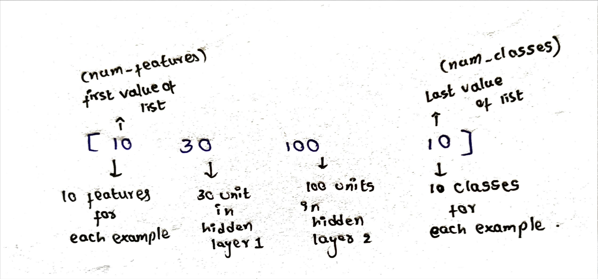
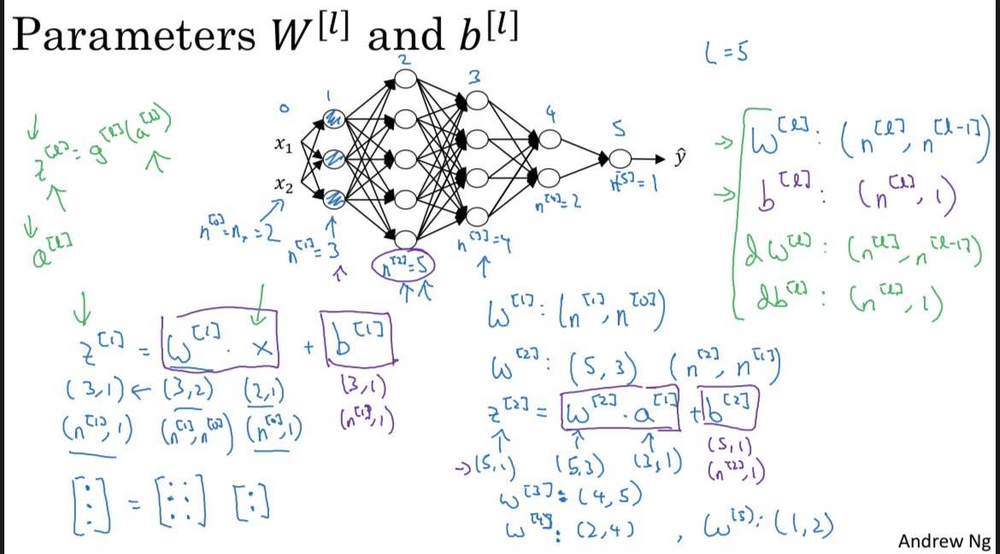
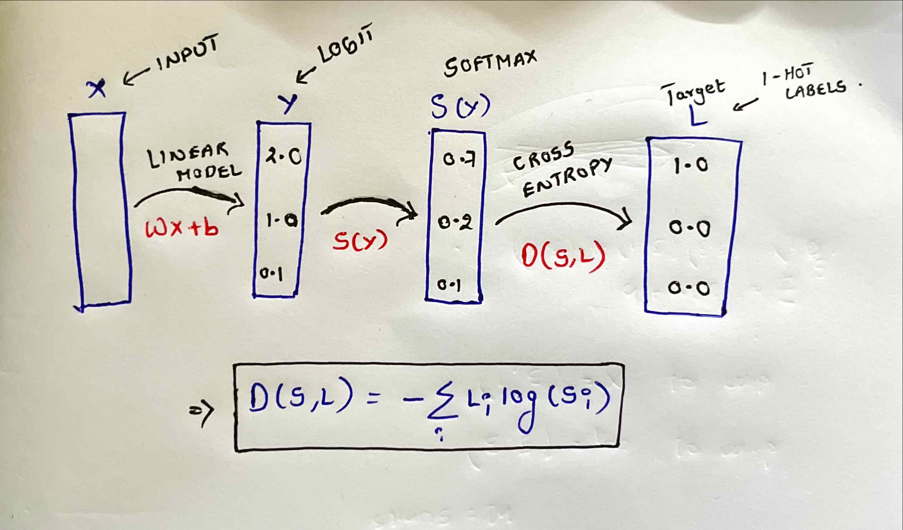
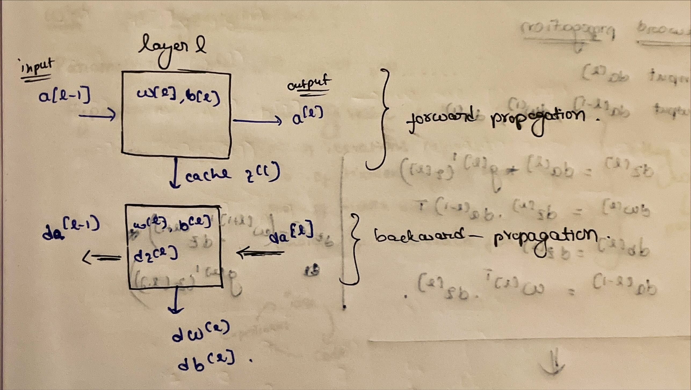
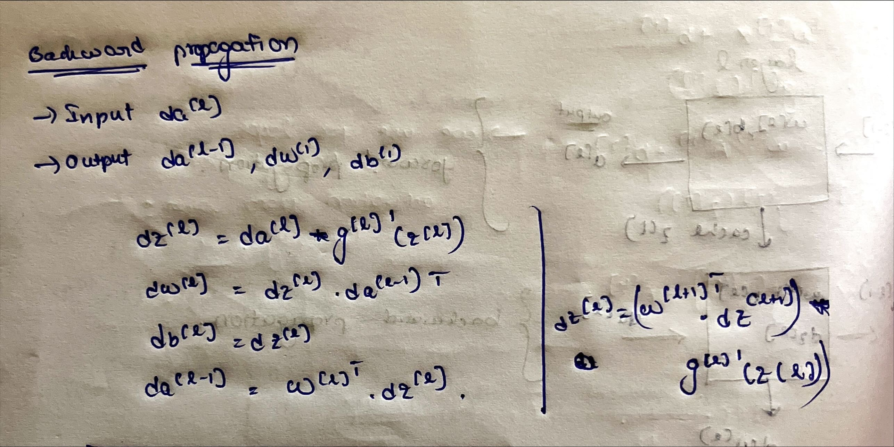
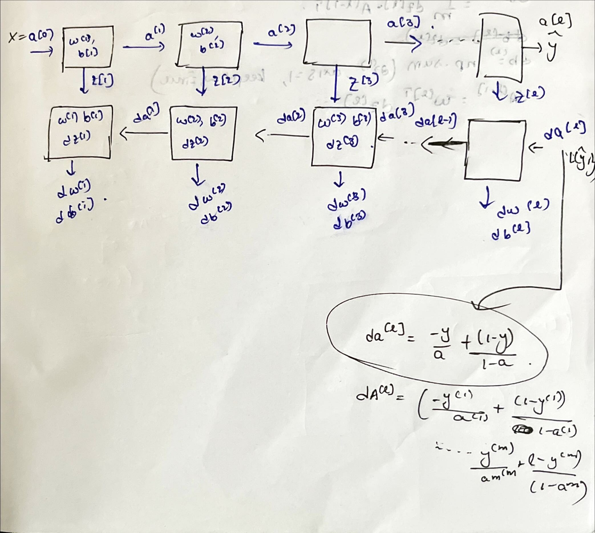

# Neural_net_from_scratch

## INITIALIZING NEURAL NETWORK
* layers => no.of layers(L), no.of features(num_features), no.of classes(num_classes)
  for example : net=NeuralNetwork([10, 30, 100, 10])
  
* Track of parameters(weignts , biases) and graients(dW , db)
* Setup() => initializing parameters.
  size of parameters W and B:
  
* ##### tf.random.normal(shape=(self.layers[i], self.layers[i-1]))
  generates random values following a normal distribution with a shape determined by self.layers[i] and self.layers[i-1]. This is typically used to initialize the weights with random values.
* ##### tf.Variable() 
  wraps this random weight matrix in a TensorFlow variable, making it trainable during the model’s training process. The weights in this matrix will be updated as the model learns from the data.

## FORWARD PROPAGATION
* Z = W.X +b
  Till last layer : activation function used => relu
  IN the last layer : softmax or sigmoid(for binary classification)
  In this code, we have left last layer without applying any activation function which we will do it later.

## LOSS COMPUTATION
  ##### tf.nn.softmax_cross_entropy_with_logits() 
  computes the softmax cross-entropy loss. 
* 
  ##### tf.reduce_mean(loss)
	•After calculating the softmax cross-entropy loss for each example in your dataset, you typically want to compute the average loss across all examples. tf.reduce_mean() is used to calculate this average.
## UPDATING PARAMETERS
*  W = W - learning_rate * dW
   where dW = (partial differentiation of loss function with respect to weight)

## PREDICT FUNCTION
* input -> Features
  output -> A = (WX + B) from output layer
  ##### tf.nn.softmax(A): 
    This applies the softmax function to the values in tensor A. The softmax function is used to convert raw logits (class scores) into probabilities. It exponentiates each element in A and normalizes them such that they sum to 1 along the specified axis. This results in a tensor containing probability distributions for each input example.
  ##### tf.argmax(..., axis=1): 
    This part finds the index (class) with the highest probability along axis 1 (which corresponds to classes in this context) for each example in the batch.
  returns -> Apply softmax function to A and return the index of maximum value among them along horizantal axis

## Training
*  
*  Backward Propagation 
   
   ##### tf.GradientTape 
   to record operations for automatic differentiation. Inside the tape, it performs the following steps:
	•	Calls the forward_pass method to compute the network’s output A given the input X.
	•	Computes the loss between the predicted A and the target Y using the compute_loss method.

   After recording the operations in the tape, it calculates gradients of the loss with respect to the weights (self.W) and biases (self.b) for each layer in the neural network, except the input layer. These gradients are stored in self.dW and self.db.
   

   It calls self.update_parameter(lr) to update the network’s parameters (weights and biases) using the calculated gradients and the learning rate lr.

*  Finally, it returns the loss value as a NumPy array.
